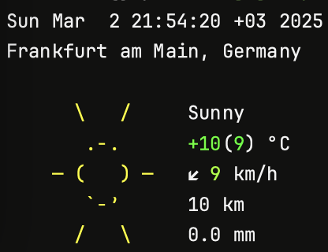

# pullweatherd

Show weather info in the shell greeting.



This daemon periodically pulls weather info in background and puts output to /var/tmp/pullweatherd.txt. Content of this file is displayed in shell greeting.

# Configuration

- Weather service

Using wttr.in as a weather info provider, feel free to use own favorite.
If you want weather for your exact location set **LOCATION** variable in **pullweatherd.sh**

- Check interval

Set update interval in _StartInterval_ section, respect limits

```xml
<key>StartInterval</key>
<integer>1800</integer>
```

# Installation

- Copy files to appropriate locations

```sh
cp com.agraqqa.pullweatherd.plist ~/Library/LaunchAgents/
sudo cp pullweatherd.sh /usr/local/bin/
sudo chmod +x /usr/local/bin/pullweatherd.sh
```

- Bootstrap service

```sh
launchctl bootstrap gui/$(id -u) com.agraqqa.pullweatherd.plist
```

- Kickstart service

```sh
launchctl kickstart -k gui/$(id -u)/com.agraqqa.pullweatherd
```

- Ensure service is running

```sh
launchctl print gui/$(id -u) | grep com.agraqqa.pullweatherd
```

- Edit your shell greeting

```sh
# fish
echo 'function fish_greeting; if test -f /var/tmp/pullweatherd.txt; cat /var/tmp/pullweatherd.txt; end; end' > ~/.config/fish/functions/fish_greeting.fish
# zsh
echo '[[ -f /var/tmp/pullweatherd.txt ]] && cat /var/tmp/pullweatherd.txt' >> ~/.zshrc
# bash
echo '[ -f /var/tmp/pullweatherd.txt ] && cat /var/tmp/pullweatherd.txt' >> ~/.bashrc
```

# Uninstall

- Bootout service

```sh
launchctl bootout gui/$(id -u) com.agraqqa.pullweatherd.plist
```

- Remove files

```sh
rm ~/Library/LaunchAgents/com.agraqqa.pullweatherd.plist
sudo rm /usr/local/bin/pullweatherd.sh
```

- Remove shell greeting
